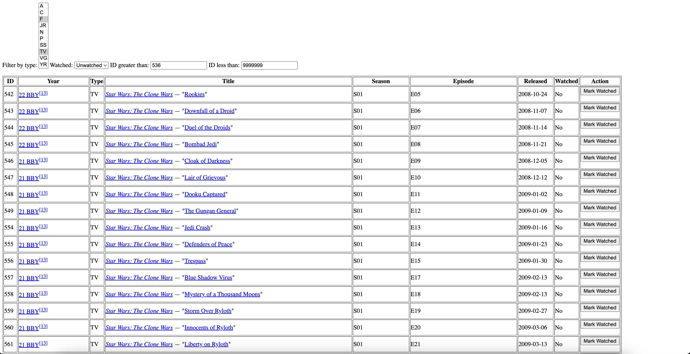

# Star Wars Canon Media Watchlist (FastAPI)

<!-- Paste a screenshot of the app UI below -->

## Screenshot



This project is a modern FastAPI web application for tracking your progress through the Star Wars canon media timeline. It features a responsive UI for filtering by media type, watched status, and ID, and is powered by a SQLite database for local storage. The app is managed with Poetry and includes scraping tools to ingest canon media from HTML sources.

Key features:

- Filter and search Star Wars canon media by type, watched status, and ID
- Mark media as watched/unwatched and preserve filters
- Scrape canon media data from HTML and store in a local database
- FastAPI-powered API and interactive web UI
- Modern Python stack: FastAPI, SQLAlchemy, Poetry, BeautifulSoup
- Easy setup and local development

## Setup

1. Install dependencies:

   ```bash
   make install
   ```
2. Run the server:

   ```bash
   make run
   ```

Visit [http://127.0.0.1:8000](http://127.0.0.1:8000) to see the API and UI.

## Other Commands

- `make test`: Run tests (requires pytest)
- `make lint`: Lint code (requires flake8)
- `make clean`: Remove cache files

## API Endpoints

- `GET /`: Returns a welcome message.
